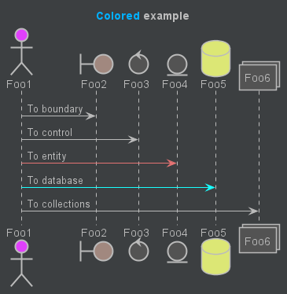

<section> <!-- You need to keep a blank line between html tags and headings -->

# Terroir Corp LLC

## Example Document
</section>

<section class="version">

## Document versions

| Version | Date       | Author(s)                                         |
|---------|------------|---------------------------------------------------|
|     1.0 | 17/04/2018 | Albin Kerouanton (<albin.kerouanton@knplabs.com>) |
|         |            |                                                   |
|         |            |                                                   |
|         |            |                                                   |
|         |            |                                                   |
</section>

<section>

### Table of Contents

<!-- toc -->
</section>

<section>

### Role management

#### YOLOOO

At vero eos et accusamus et iusto odio dignissimos ducimus qui blanditiis praesentium voluptatum deleniti atque corrupti quos dolores et quas molestias excepturi sint occaecati cupiditate non provident, similique sunt in culpa qui officia deserunt mollitia animi, id est laborum et dolorum fuga. Et harum quidem rerum facilis est et expedita distinctio. Nam libero tempore, cum soluta nobis est eligendi optio cumque nihil impedit quo minus id quod maxime placeat facere possimus, omnis voluptas assumenda est, omnis dolor repellendus. Temporibus autem quibusdam et aut officiis debitis aut rerum necessitatibus saepe eveniet ut et voluptates repudiandae sint et molestiae non recusandae. Itaque earum rerum hic tenetur a sapiente delectus, ut aut reiciendis voluptatibus maiores alias consequatur aut perferendis doloribus asperiores repellat.

1. Lorem ipsum dolor sit amet, consectetur adipiscing elit.

> Lorem ipsum dolor sit amet, consectetur adipiscing elit. Pellentesque ornare ac enim eu porttitor. In congue consequat diam, eget semper lacus viverra at. Nam nec tempor tellus.

2. Pellentesque leo odio, commodo sed magna eget, auctor condimentum enim.

> Vestibulum imperdiet ex ac porttitor sollicitudin. Etiam urna urna, maximus non condimentum vitae, facilisis a velit. Morbi justo nulla, feugiat lobortis ornare et, feugiat sed justo. Vivamus laoreet risus ut mi dapibus aliquet. Vestibulum ante ipsum primis in faucibus orci luctus et ultrices posuere cubilia Curae; Curabitur porta nibh a velit ornare molestie.

Praesent tincidunt mattis lectus, quis efficitur nibh egestas at. Donec venenatis elit non interdum sodales. Pellentesque interdum venenatis justo rutrum sodales. Sed iaculis augue non condimentum aliquam. Aenean non tellus magna. Sed egestas pellentesque risus id fringilla. Aenean vitae placerat sem, eget varius sem. Donec nec dui ac tellus dignissim eleifend. Praesent quis risus quis purus facilisis efficitur nec vel justo. Donec ut tortor nunc.

Integer vel orci nisi. Vestibulum et fermentum quam. Morbi vel ante et augue consectetur vehicula eget a tellus. Maecenas non eros dui. Sed nec tincidunt augue. Nunc viverra mi eget lacinia maximus. Vestibulum sed consequat nunc. In porttitor ligula sem, ut cursus ex cursus nec. Quisque pellentesque nunc id dolor hendrerit, vitae pellentesque turpis facilisis. Interdum et malesuada fames ac ante ipsum primis in faucibus. Sed at fringilla quam, nec viverra eros. Aliquam accumsan justo neque, id commodo neque laoreet sit amet. Cras et risus vitae felis feugiat accumsan eget in neque. Duis at arcu tincidunt, feugiat erat et, dapibus nunc. Morbi ut purus id mauris pellentesque pulvinar. Nullam eget imperdiet eros.

* Maecenas dapibus risus vel orci volutpat, sed lobortis libero euismod.
* Fusce accumsan mi ut dolor vulputate, vel interdum erat pellentesque.

On the other hand:

* Nunc eget eros quis nulla malesuada tristique lacinia sit amet purus.
* Suspendisse at ante ac ligula dignissim malesuada.
* Donec et lectus porttitor, iaculis ligula ac, varius elit.

* Praesent quis ligula non dui placerat laoreet.
* Nulla sed neque ac risus vulputate mollis.
* Nam vestibulum mi elementum ornare tristique.
* Vivamus rutrum est et fermentum tincidunt.

---

* Maecenas tempor justo eu enim volutpat vulputate.
* Cras elementum turpis placerat enim tincidunt, et pretium massa dignissim.
* Sed ac sem sit amet quam gravida ornare.
* Donec at elit eu magna volutpat viverra.
* Aliquam vitae velit lobortis, finibus diam in, scelerisque eros.
</section>

<section>

### Diagram



Comes from: https://daniilsolovyov.github.io/plantuml-bells-and-whistles/

</section>

<section>

### `marcel chauffe`

#### Why?

See here: [Marcel, the french Docker - Marcel, le docker français](https://github.com/brouberol/marcel) and here: [moby/moby#19396](https://github.com/moby/moby/issues/19396):

```Dockerfile
# This is an example RecetteÀMarcel file
DEPUIS debian:latest
CRÉATEUR Thomas Maurice <thomas@maurice.fr>

LANCE apt-get update && apt-get upgrade -y
LANCE useradd manuel

UTILISATEUR manuel

ORDRE echo "La baguette hon hon hon"
```

https://github.com/brouberol/marcel/blob/master/examples/RecetteÀMarcel

#### Source code

```python
#!/usr/bin/env python
# coding: utf-8

"""
Marcel is a french wrapper around the docker CLI, intended as a drop-in
replacement of docker, for the future french sovereign operating system.
"""

import subprocess
import sys
import re
import os
import six

from os.path import exists, join

__version__ = '0.1.0'

TRANSLATIONS = {
    # Commands
    u'chauffe': u'run',
    u'fais': u'exec',
    u'pousse': u'push',
    u'apporte': u'pull',
    u'bûches': u'logs',
    u'grève': u'suspend',
    u'matuer': u'kill',
    u'perquisitionne': u'inspect',
    u'construis': u'build',
    u'charge': u'load',
    u'plagie': u'copy',
    u'france24': u'info',
    u'insee': u'stats',
    u'rtt': u'pause',
    u'sur-ecoute': u'attach',
    u'cederoms': u'images',
    u'vos-papiers': u'login',
    u'déchéance': u'logout',
    u'sauvegarde': u'save',
    u'graffiti': u'tag',
    u'rsa': u'rmi',
    u'assigne-à-résidence': u'commit',
    u'roman-national': u'history',
    u'recycle': u'rm',
    u'cherche': u'search',
    u'réseau': u'network',
    u'marseille': u'port',
    u'renomme': u'rename',
    u'auboulot': u'unpause',
    u'barrage': u'wait',
    # Options
    u'--aide': u'--help',
    u'--graffiti': u'--tag',
    u'--sortie': u'--output',
    u'--auteur': u'--author',
    u'--49-3': u'--force',
    u'--etat-d-urgence': u'--privileged',
    u'--disque-numerique-polyvalent': u'--dvd'
}

MARCELFILE_TRANSLATIONS = {
    u'DEPUIS': u'FROM',
    u'CRÉATEUR': u'MAINTAINER',
    u'LANCE': u'RUN',
    u'ORDRE': u'CMD',
    u'ÉTIQUETTE': u'LABEL',
    u'DÉSIGNER': u'EXPOSE',
    u'EELV': u'ENV',
    u'AJOUTER': u'ADD',
    u'COPIER': u'COPY',
    u'POINT D\'ENTRÉE': u'ENTRYPOINT',
    u'UTILISATEUR': u'USER',
    u'LIEU DE TRAVAIL': u'WORKDIR',
    u'BTP': u'ONBUILD',
    u'APÉRITIF': u'STOPSIGNAL',
}


def translate_marcelfile(marcelfile):
    """
    Converts a RecetteÀMarcel to a Dockerfile
    :param input_file: Input filename
    :param output_file: Output filename
    :return: The translated Dockerfile as a string
    """

    for key in MARCELFILE_TRANSLATIONS:
        expression = re.compile(r'(^|\n)%s' % key, re.UNICODE)
        marcelfile = expression.sub(r"\1%s" % MARCELFILE_TRANSLATIONS[key], marcelfile)
    return marcelfile


def use_marcelfile(command):
    """
    Detect if a RecettesÀMarcel file is present in the current directory.
    If so, inject a "-f ./RecettesÀMarcel" argument in the docker build command,
    if such an argument was not already passed.
    """
    curdir = os.getcwd()
    marcelfile_path = join(curdir, u'RecetteÀMarcel')
    dockerfile_path = join(curdir, u'.RecetteÀMarcel.Dockerfile')
    if not exists(marcelfile_path) or '-f' in command:
        return command

    # We want to generate a file with the proper Dockerfile format
    with open(marcelfile_path) as marcelfile,  open(dockerfile_path, 'w') as dockefile:
        marcelfile_content = marcelfile.read()
        if six.PY2:  # pragma: no cover
            marcelfile_content = marcelfile_content.decode('utf-8')
        translated_marcelfile = translate_marcelfile(marcelfile_content)
        if six.PY2:  # pragma: no cover
            translated_marcelfile = translated_marcelfile.encode('utf-8')
        dockefile.write(translated_marcelfile)
    command = command[:2] + ['-f', u'./.RecetteÀMarcel.Dockerfile'] + command[2:]
    return command


def replace_command(command):
    """Replace the executable itself for given values of the first command."""
    if len(command) > 1 and command[1] == 'et-son-orchestre':
        command.pop(0)
        command[0] = 'docker-compose'
    else:
        command[0] = 'docker'
    return command


def translate_command(command):
    """Translate the french parts of the command to docker syntax."""
    command = replace_command(command)
    return [TRANSLATIONS.get(chunk, chunk) for chunk in command if chunk]


def build_command(command):
    """Translate the command from marcel syntax to docker."""
    command = translate_command(command)
    if len(command) > 1:
        subcommand = command[1]
        if subcommand == 'build':
            command = use_marcelfile(command)
    return command


def main():  # pragma: no cover
    """Run docker commands from marcel syntax."""
    subprocess.call(build_command(sys.argv))


if __name__ == '__main__':   # pragma: no cover
    main()
```

https://github.com/brouberol/marcel/blob/master/marcel.py
</section>

<section>

### Containers Will Not Fix Your Broken Culture (and Other Hard Truths)

https://queue.acm.org/detail.cfm?id=3185224

> 1. Tech is Not a Panacea
> According to noted thought leader Jane Austen, it is a truth universally acknowledged that a techie in possession of any production code whatsoever must be in want of a container platform.
>
> Or is it? Let's deconstruct the unspoken assumptions. Don't get me wrong—containers are delightful! But let's be real: we're unlikely to solve the vast majority of problems in a given organization via the judicious application of kernel features. If you have contention between your ops team and your dev team(s)—and maybe they're all facing off with some ill-considered DevOps silo inexplicably stuck between them—then cgroups and namespaces won't have a prayer of solving that.
>
> Development teams love the idea of shipping their dependencies bundled with their apps, imagining limitless portability. Someone in security is weeping for the unpatched CVEs, but feature velocity is so desirable that security's pleas go unheard. Platform operators are happy (well, less surly) knowing they can upgrade the underlying infrastructure without affecting the dependencies for any applications, until they realize the heavyweight app containers shipping a full operating system aren't being maintained at all.
>
> Ah, but, you say, at our org we do this right (for sufficiently non-terrible values of "right")! We inject credentials at runtime, and run exactly the same containers in every environment. Perhaps we even ship lightweight containers with only statically linked binaries. Okay, but traffic patterns and data tested across various environments are likely not close to the same. As the old joke goes:
>
> Proposal: rename 'staging' to 'theory'. "It works in theory, not on production." —Najaf Ali
>
> There is no substitute for experimentation in your real production environment; containers are orthogonal to that, while cross-org communication is crucial to clarity of both purpose and intent. Observability being key is a fundamental tenet of the gospel according to Charity Majors. The conflicts inherent in misaligned incentives continue to manifest no matter where the lines of responsibilities are drawn. Andrew Clay Shafer calls the state of any running system "continuous partial failure;" good tooling is necessary (but not sufficient) to operate a robust fault-tolerant system.
>
> Relying on health checks in your continuous delivery is all well and good, until the health check is full of deceit and lies because it says everything is 200 OK, and all those instances are staying in the load balancer, and yet nothing is working. (My on-call PTSD may be showing.)
>
> In a world of ever-increasing complexity, how do we evaluate our progress toward a Container-Store utopia? How do we know when to course-correct? How do we react when it seems like there's always something new we should have done last month? Must I really orchestrate my containers? Could they maybe just do some improv jazz?

</section>
